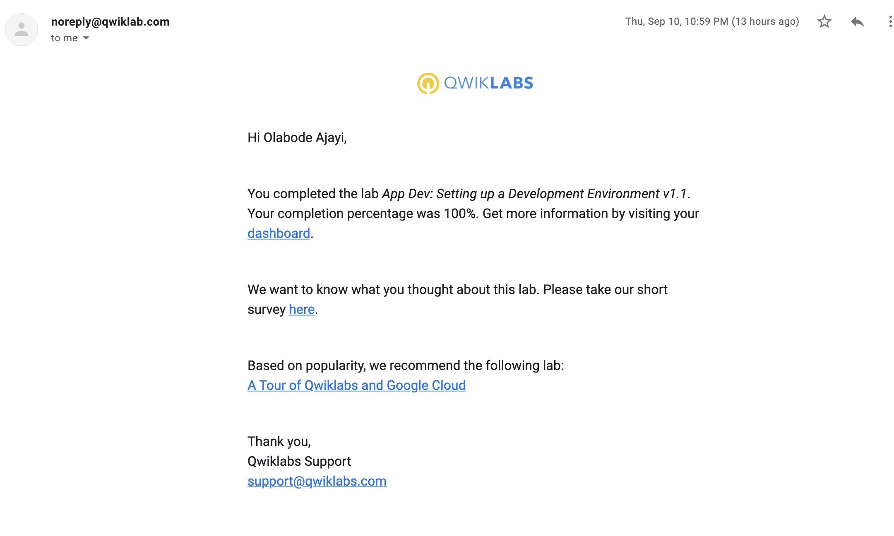
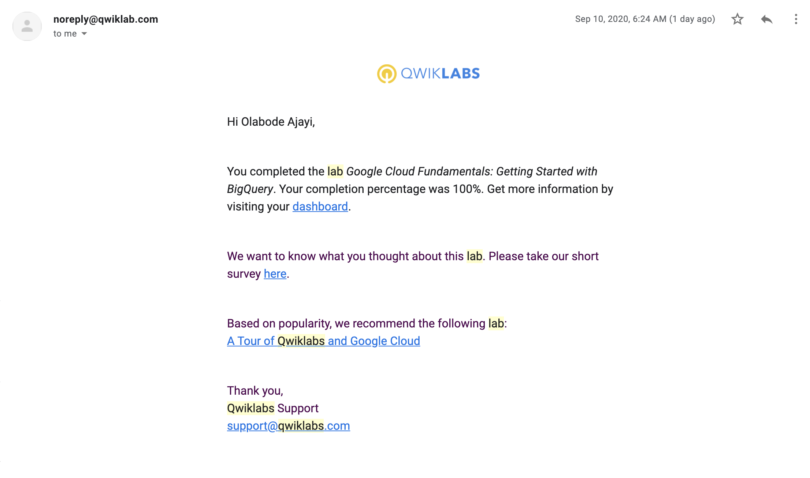
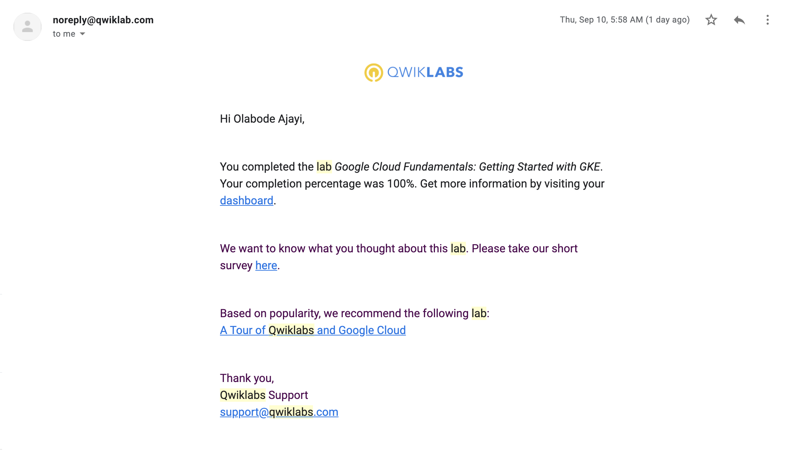

# GAD_2020_Practise_Project
### Olabode Ajayi (3004115@myuwc.ac.za)
This repo is based on the Qwiklabs and email confirmation screenshot for lab completed. Also, the repo contain Lab translation commands in fulfilment of the requirements for the 2020 Google Africa Developer Scholarship program (GCP Track).

## QWIKLABS COMPLETED

<details>
  <summary>Lab 1: Implement Private Google Access and Cloud NAT.</summary>
  
</details>

<details>
  <summary>Lab 2: App Dev-Storing Application Data in Cloud Datastore.</summary>
  
</details>

<details>
  <summary>Lab 3: App Dev Setting up a Development Environment v1.1.</summary>
  
</details>

<details>
  <summary>Lab 4: Google Cloud Fundamentals: Getting Started with Cloud Storage and Cloud SQL.</summary>
  
</details>

<details>
  <summary>Lab 5: Google Cloud Fundamentals: Big Data and Machine Learning in the Cloud.</summary>
  
</details>

<details>
  <summary>Lab 6: Google Cloud Fundamentals: Getting Started with BigQuery.</summary>
  
</details>

<details>
  <summary>Lab 7: Google Cloud Fundamentals: Getting Started with Google Kubernetes.</summary>
  
</details>

<details>
  <summary>Lab 8: Google Cloud Fundamentals: Virtual Machines in the Cloud.</summary>
  
</details>

<details>
  <summary>Lab 9: Google Cloud Fundamentals: Getting Started with Compute Engine.</summary>
  
</details>

<details>
  <summary>Lab 10: Working with Virtual Machines.</summary>
  
</details>

<details>
  <summary>Lab 11: Google Cloud Fundamentals: Getting Started with Cloud Marketplace.</summary>
  
</details>

<details>
  <summary>Lab 12: Console and Cloud Shell.</summary>
  
</details>


## LAB TRANSLATED CODE


## Lab 1: Google Cloud Fundamentals: Getting Started with GKE

### Objectives:

In this lab, you learn how to perform the following tasks:

 - Provision a Kubernetes cluster using Kubernetes Engine.

 - Deploy and manage Docker containers using `kubectl`.

 ### Steps:

1. Confirm that needed APIs are enabled.

    1. Use the gcloud services command to confirm that both the Kubernetes Engine API and the Containers Registry API are enabled:

        `gcloud services list --enabled`

    Result: (DEFAULT) Return the services which the project has enabled. That is both API's are enabled:

    *	Kubernetes Engine API
    *	Container Registry API


2. Start a Kubernetes Engine cluster.

    1. Assign your Qwiklabs zone to an environment variable called MY_ZONE:

        `export MY_ZONE=us-central1-a`

    2. Start a Kubernetes cluster managed by Kubernetes Engine. Name the cluster webfrontend and configure it to run 2 nodes:

        `gcloud container clusters create webfrontend --zone $MY_ZONE --num-nodes 2`

    3. After the cluster is created, check your installed version of Kubernetes using the kubectl version command:

        `kubectl version`

3. Run and deploy a container.

    1. Launch a single instance of the nginx container:

        `kubectl create deploy nginx --image=nginx:1.17.10`

    2. View the pod running the nginx container:

        `kubectl get pods`

    3. Expose the nginx container to the Internet:

        `kubectl expose deployment nginx --port 80 --type LoadBalancer`

    4. View the new service:

        `kubectl get services`

        - Result: The external IP address to view your webserver's home page.

    5. Scale up the number of pods running on your service:

        `kubectl scale deployment nginx --replicas 3`

    6. Confirm that Kubernetes has updated the number of pods:

        `kubectl get pods`

    7. Confirm that your external IP address has not changed:

        `kubectl get services`

        - Result: The IP address did not change.


## Lab 2: Google Cloud Fundamentals: Getting Started with Compute Engine

### Objectives:

In this lab, you will learn how to perform the following tasks:

    - Create a Compute Engine virtual machine using the Google Cloud Platform (GCP) Console.

    - Create a Compute Engine virtual machine using the gcloud command-line interface.

    - Connect between the two instances.

### Steps:

1. Create a Compute Engine virtual machine using the Google Cloud Platform (GCP) Console.

    ```gcloud compute instances create "my-vm-1"
      --machine-type "n1-standard-1"
      --image-project "debian-cloud"
      --image "debian-9-stretch-v20190213"
      --subnet "default"
      --tags http

    gcloud compute firewall-rules create allow-http`
      --action=ALLOW
      --destination=INGRESS
      --rules=http:80
      --target-tags=http

    ```


2. Create a Compute Engine virtual machine using the gcloud command-line interface.

    `gcloud config set compute/zone us-central1-b`

    `gcloud compute instances create "my-vm-2"`
    `--machine-type "n1-standard-1"`
    `--image-project "debian-cloud"`
    `--image "debian-9-stretch-v20190213"`
    `--subnet "default"`


3. Connect between the two instances.

1. Use the ping command to confirm that my-vm-2 can reach my-vm-1 over the network:

  - Connect to my-vm-2:

      `gcloud compute ssh my-vm-2`

  - Ping my-vm-1 from my-vm-2:

      `ping -c 4 my-vm-1`

  - Use the ssh command to open a command prompt on my-vm-1 from my-vm-2:

      `ssh my-vm-1`

  - At the command prompt on my-vm-1, install Nginx web server:

      `sudo apt-get install nginx-light -y`

  - Use the nano text editor to add a custom message to the home page of the web server:

      `sudo nano /var/www/html/index.nginx-debian.html`

  - Add text like this, and replace YOUR_NAME with your name:

      `Hi from Brave`

  - Exit the editor and confirm that the web server is serving your new page. At the command prompt on my-vm-1, execute this command:

      `curl` `http://localhost/`

  - Result: The response will be the HTML source of the web server's home page, including your line of custom text.

  - To exit the command prompt on my-vm-1, execute this command:

      `exit`

  - To confirm that my-vm-2 can reach the web server on my-vm-1, at the command prompt on my-vm-2, execute this command:

      `curl` `http://my-vm-1/``

  - Result: The response will again be the HTML source of the web server's home page, including your line of custom text.

2. Now get the external IP of the my-vm-1 instance from this command:

    `gcloud compute instances list --zone us-central1-a`

3. Paste the copied IP address of my-vm-1 into a new browser tab and hit enter:

  - Result: You will see your web server's home page, including your custom text.


## LAB 3: Google Cloud Fundamentals: Getting Started with App Engine

### Objectives:
